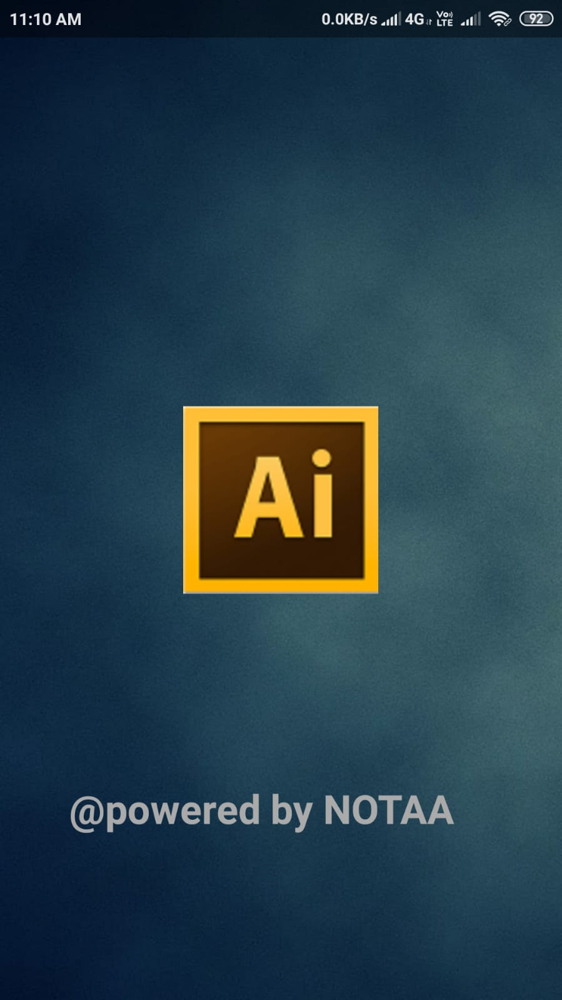
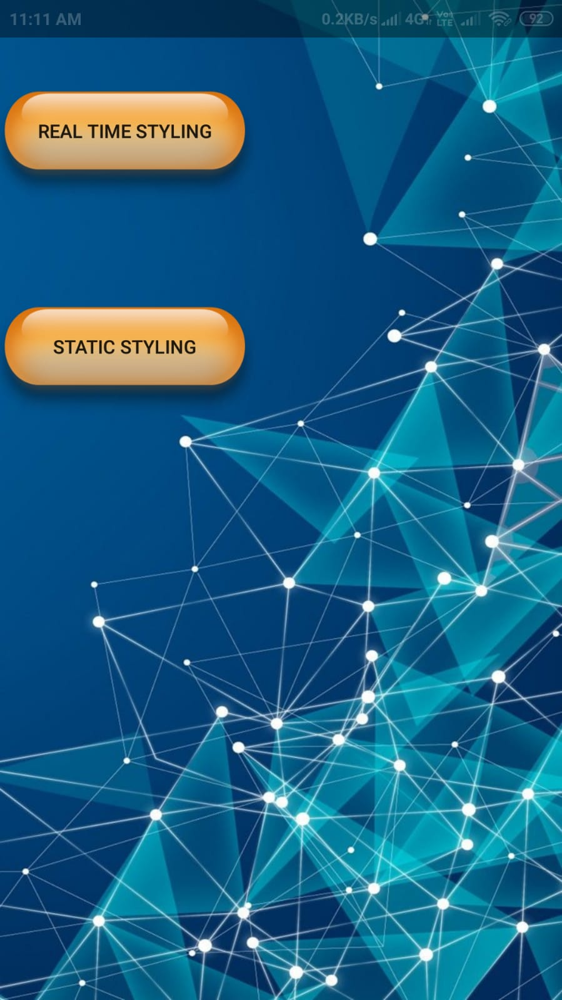
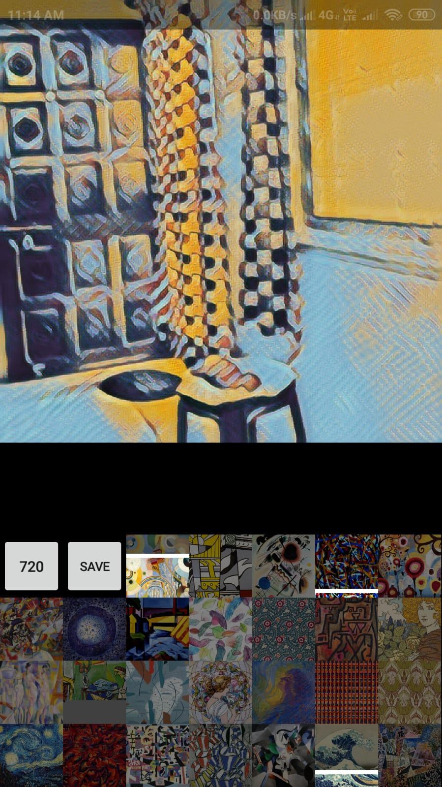
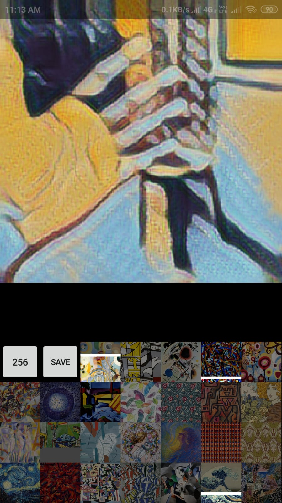

# AI-ArtGen

An Android Application which add styles to both Real-Time and Static images using a quantized model created with Tensorflow Lite converter using DCGAN(Deep Convolutional Generative Adversial Networks) and transfer learning.

Team members: Anshul Shaive, Om Prakash Namdeo, Aditya Joshi

 

